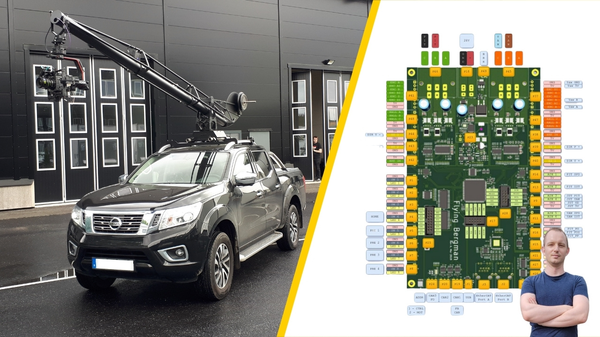
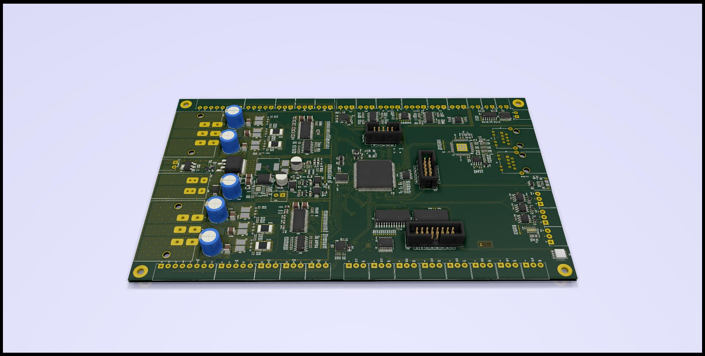
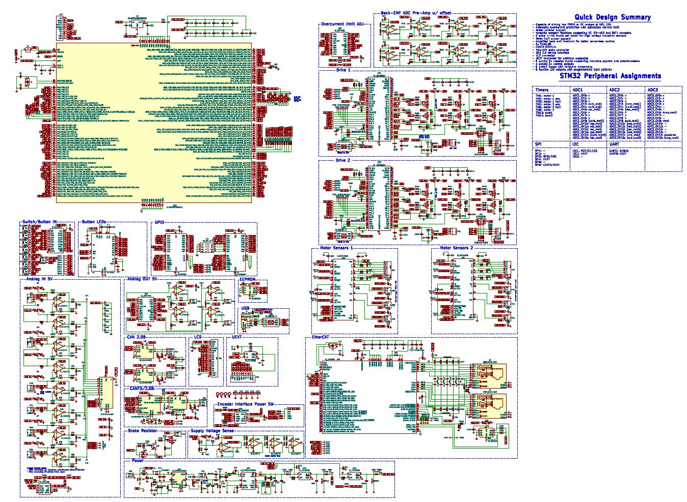

# CraneControl Schematic and PCB

**Electronic hardware for controlling a vehicle mounted movie production crane**

	Copyright (c) 2019-2022 Martin Schröder, All rights reserved.

- Connect with me on LinkedIn: https://www.linkedin.com/in/martinschroder/
- Connect by email: martin.schroder@swedishembedded.com

This repository contains electical schematic and pcb layouts for boards that
can be used to control a movie production camera crane.

What does such a crane look like in practice? Well here is CraneControl boards
providing HMI and dual motor control function to FlyingBergman movie production
crane (click on images to watch the video):

[FlyingBergman](https://flyingbergman.se) crane is best known for being used for filming all car scenes in
2022 Netflix series "Clark".

If you are a movie producer and would like to order finished product then send
an email to info@swedishembedded.com and ask for more information. The complete
FlyingBergman setup also includes the crane assembly, HMI control panel for
mounting inside the vehicle and all necessary electronics.

## CraneControl platform

FlyingBergman is only one specific application of crane control hardware
design. CraneControl was originally designed to be a versatile solution capable
of advanced features like field oriented control of 2 60V PMSM motors at the
same time using the same microcontroller. It was also designed to provide
modern communication options like CAN-FD and EtherCAT.

In the case of FlyingBergman only a subset of these features was used - meaning
there is a lot of room to epand the use of this hardware for achieving more
complex control tasks in an industrial environment.

## Block diagram

## Schematic PDF

## Who is this for

This repository is for you if:

- You are a student of embedded systems courses at swedishembedded.com
  (https://swedishembedded.com/tag/training).

- You are building industrial control solutions and you would like to add
  support for advanced motor control (in this case you can also contract this
  task to Swedish Embedded Consulting Group. Book a call here:
  https://swedishembedded.com/book-call)

- You are simply curious about designing practical hardware and would like to
  learn from this project.

## License

You may use this design as inspiration for other designs as long as you develop
schematic and layout by yourself. You may also use this design as learning
materials for study.

If you would like to build a commercial product using this design then you can
contract Swedish Embedded Consulting Group to implement a specialized
hardware/software solution for you (send and email to
info@swedishembedded.com).

## Building

To generate gerbers for this design from command line you can use kibot
(https://github.com/INTI-CMNB/KiBot) with provided 'motordriver-2x.kibot.yaml'
file in this repository.

You can also edit this design in KiCad (version 6.0 or above).

